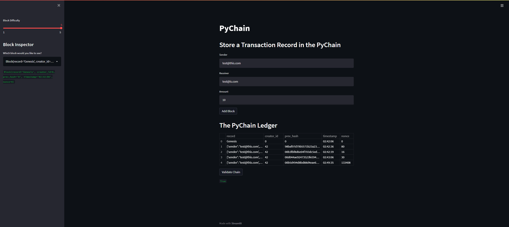

# PyChain Ledger

You’re a fintech engineer who’s working at one of the five largest banks in the world. You were recently promoted to act as the lead developer on their decentralized finance team. Your task is to build a blockchain-based ledger system, complete with a user-friendly web interface. This ledger should allow partner banks to conduct financial transactions (that is, to transfer money between senders and receivers) and to verify the integrity of the data in the ledger.
You’ll make the following updates to the provided Python file for this assignment, which already contains the basic PyChain ledger structure that you created throughout the module:

Create a new data class named Record. This class will serve as the blueprint for the financial transaction records that the blocks of the ledger will store.

Modify the existing Block data class to store Record data.

Add Relevant User Inputs to the Streamlit interface.

Test the PyChain Ledger by Storing Records.

---

## PyChain ledger using Streamlit

Using Streamlit, an interactive reporting capability could be produced to store transaction records within the PyChain. 

---

## Instructions: how to use this tool

 1. Clone the repository to your local machine
 2. Navigate (in the terminal) run the streamlit application by typing `streamlit run pychain.py`
 3. Utilise the tool and its interactive features by inputting data into the 'Sender', 'Receiver' and 'Amount' text boxes located within the tool. 
 4. Proceed to click 'Add block'
 5. Validate the chain by clicking 'Validate Chain'

 ---

 *Author: Mitchell Langdon*
